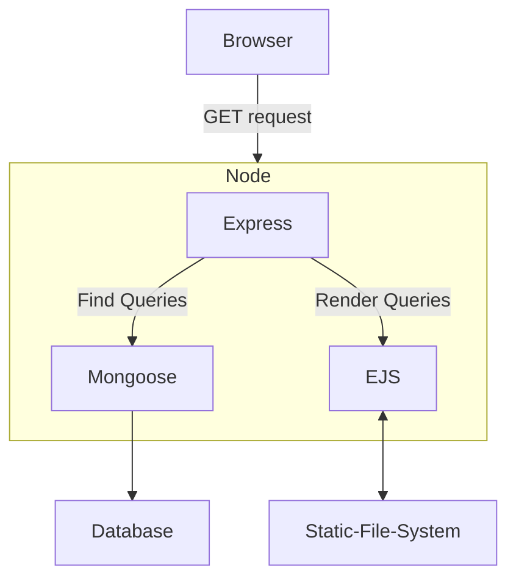
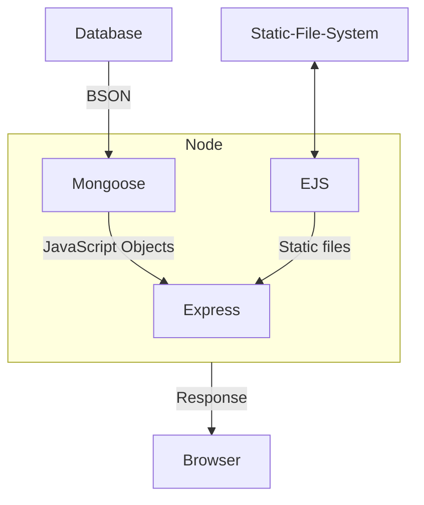

# Web Dev Project

## Aim
To create a catalogue of Video Games to be referenced to by everyone.

## Theory
## Request Response Cycle
1. Request

2. Response

## Tech Stack
- HTML
- CSS
- JavaScript
- Node
- Express
- MongoDB
- Embedded JavaScript
## Future Scope
1. Addition of Account Systems
2. URL Validation for Game Websites
3. Search Bar
## References
1. [IGDB](https://www.igdb.com/)
2. [IMDB](https://www.imdb.com/)

## Conclusion
A website fit for basic queries and searches has been created.